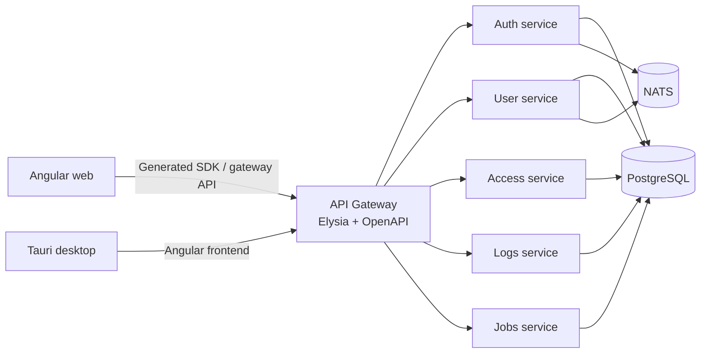

# Monobungsia

Monobungsia adalah monorepo enterprise berbasis Bun. Satu repository berisi Angular web client, Tauri desktop shell, API Gateway berbasis Elysia, service domain, durable jobs runtime, dan MCP server yang dikembangkan serta diverifikasi dari root workspace.

## Arsitektur



API Gateway adalah public entry point. Web client tidak memanggil service domain secara langsung. Service tidak mengimpor source service lain.

## Struktur

`apps/web` berisi Angular 22 dengan `@ojiepermana/angular` sebagai design system dan route auth/logs/settings.

`apps/tauri` berisi shell desktop Tauri v2 yang memakai build frontend dari `apps/web`. Ia memakai lifecycle command root `dev:tauri`, `typecheck:tauri`, dan `build:tauri`.

`apps/gateway/erp` berisi routing public, CORS, request ID, OpenAPI public, dan forwarding ke service internal. Gateway tidak memiliki business logic domain.

`apps/services/*` berisi auth, user, access, logs, dan jobs. Setiap service memiliki composition root, config typed, plugin lokal, module domain, repository domain, database boundary, serta test sesuai tanggung jawabnya. Notification service masih berada dalam scope spec 0012 dan belum tersedia.

`packages/contracts` berisi HTTP artifacts OpenAPI dan event contracts. `packages/angular-sdk` berisi generated client dari kontrak gateway untuk consumer eksternal. `packages/database` hanya berisi Bun SQL native untuk PostgreSQL. `packages/jobs` berisi registry contract, durable queue runtime, worker, dan scheduler PostgreSQL. `packages/messaging` hanya berisi abstraction NATS. `packages/acl`, `packages/config`, `packages/logger`, `packages/elysia`, dan `packages/errors` berisi infrastructure lintas service yang benar benar reusable.

Root `package.json` adalah sumber dependency versioning, import map `#project/*`, dan scripts untuk seluruh app. Bun membuat satu physical `node_modules` di root. Tidak ada `package.json` atau `node_modules` di bawah `apps` dan `packages`; semua source dijalankan langsung dari root.

Tidak ada `BaseRepository`, `GenericRepository`, `GenericService`, atau query builder generik. Repository tetap domain specific dan berada di service pemilik domain.

## Dependency flow

```text
HTTP request
  -> route
  -> Elysia schema validation
  -> service
  -> domain repository
  -> database package
  -> PostgreSQL
```

Route tidak memanggil repository langsung. Repository tidak mengetahui HTTP. Transaction boundary berada di service dan dapat memakai `withTransaction` dari package database.

## Service ports

| App         | Port | Public path   |
| ----------- | ---: | ------------- |
| web         | 4200 | Angular SPA   |
| api gateway | 3000 | `/api/v1/*`   |
| auth        | 3101 | internal only |
| user        | 3102 | internal only |
| logs        | 3103 | internal only |
| access      | 3104 | internal only |
| jobs        | 3105 | internal only |

Setiap app memiliki `GET /health`. Service module smoke endpoint berada pada `/internal/<module>/status` dan hanya menjadi contoh boundary awal.

## Menjalankan development

Prasyarat: Bun 1.4 atau lebih baru. Dependency dikelola hanya dengan Bun.

```bash
bun install
cp .env.example .env
bun run doctor
bun run dev:web
bun run dev:gateway
bun run dev:auth
bun run dev:user
bun run dev:logs
bun run dev:access
bun run dev:jobs
```

`bun run doctor` memeriksa versi Bun, dependency, entrypoint dan port seluruh dev stack. Jika `ENABLE_INFRASTRUCTURE=true`, doctor juga memeriksa konfigurasi serta konektivitas PostgreSQL, schema hasil migrasi, NATS, dan SMTP.

`bun run dev` menjalankan seluruh app secara paralel. Untuk development lokal tanpa PostgreSQL dan NATS, biarkan `ENABLE_INFRASTRUCTURE=false`. Koneksi Bun SQL dan NATS dibuat oleh `main.ts` hanya ketika flag tersebut diaktifkan.

Untuk menerima magic link di Laravel Herd Pro Mail, aktifkan Herd Mail lalu gunakan nilai SMTP pada `.env.example`: `127.0.0.1:2525`, username `monobungsia`, dan password kosong. Set `ENABLE_INFRASTRUCTURE=true` setelah PostgreSQL dan NATS lokal tersedia; email akan muncul di inbox `monobungsia` pada Herd.

Script utama:

```bash
bun run dev
bun run doctor
bun run dev:web
bun run dev:tauri
bun run test
bun run test:web
bun run lint
bun run typecheck
bun run build
bun run build:tauri
bun run openapi:generate
bun run openapi:validate
bun run check:dependencies
bun run progress:generate
bun run progress:check
bun run db:migrate
bun run db:seed
bun run db:reset --confirm --seed
```

## OpenAPI dan generated SDK

Schema Elysia adalah source of truth. `scripts/openapi-generate.ts` membuat spec dengan memanggil `/openapi/json` pada app composition root, tanpa perlu menyalakan server.

Hasilnya ditulis ke `openapi.yaml` pada gateway dan service yang tersisa. Public gateway spec juga disalin ke `packages/contracts/openapi/generated/public-api.openapi.yaml`.

`bun run openapi:generate` lalu menjalankan `@hey-api/openapi-ts` dan menulis generated SDK ke `packages/angular-sdk/src/generated`. Folder generated tidak diedit manual. Consumer dapat mengimpor `#project/angular-sdk` dari root import map.

`bun run openapi:validate` memeriksa OpenAPI 3, `info`, dan `paths` pada seluruh spec.

## NATS dan event

`packages/messaging` menyediakan publisher, subscriber, request response, dan lifecycle connection untuk NATS. Business service memakai abstraction ini, bukan detail connection di seluruh business logic.

Event contract ada di `packages/contracts/src/events`. Event handler implementation tetap berada di module service pemilik event. Event contract awal yang tersedia adalah user invited, user created, user updated, user deleted, dan access permission changed.

## Database

`packages/database` menyediakan native Bun SQL client untuk PostgreSQL, transaction helper, close helper, dan runner database internal. Migration serta seed canonical berada di `packages/database/migrations` dan `packages/database/seeds`, bukan di dalam service deployable.

PostgreSQL 18 menjadi prasyarat. Semua primary key application table memakai `uuid` dengan default native `uuidv7()`. Database memakai multischema dengan ownership berikut:

| Scope     | Schema      |
| --------- | ----------- |
| auth      | `auth`      |
| access    | `access`    |
| user      | `user`      |
| logs      | `logs`      |
| jobs      | `jobs`      |
| notification | `notification` |

Gunakan `DATABASE_MIGRATION_URL` untuk role migration. `DATABASE_RESET_ALLOWED=true` hanya boleh dipakai pada development atau test.

Role PostgreSQL dibuat oleh DBA atau infrastructure automation, bukan oleh migration runner. Nama role canonical adalah `project_migrator`, `project_auth_runtime`, `project_access_runtime`, `project_user_runtime`, `project_logs_writer`, `project_jobs_runtime`, dan `project_notification_runtime`. Role `project_auth_runtime`, `project_access_runtime`, `project_user_runtime`, dan `project_notification_runtime` hanya mendapat akses data pada schema pemiliknya. `project_jobs_runtime` hanya mendapat fungsi queue dan akses operator yang didefinisikan migration jobs. Password serta atribut login harus disimpan di secret manager, dan semua role harus dibuat sebelum migration grants dijalankan. Auth email links use `PUBLIC_API_URL`, then redirect to `WEB_APP_URL` after verification.

```bash
bun run db:migrate
bun run db:seed
bun run db:reset --confirm --seed
bun run db:migrate:down --steps 1
bun run db:seed:reset --service auth
```

`db:migrate` dan `db:seed` menerima `--service <name>` serta `--dry-run` yang sesuai. Reset hanya menghapus schema allowlist dan tracking table, tidak menghapus database.

Semua query baru harus menggunakan parameter binding. Filtering dan sorting harus memakai field whitelist di repository domain. Jangan membuat dynamic SQL framework generik.

## Error, logging, dan shutdown

`packages/errors` menyediakan `AppError` serta error HTTP umum. Setiap Elysia app memiliki global error mapping yang tidak mengembalikan error database mentah.

`packages/logger` menulis JSON structured log dengan timestamp, level, service, request ID, dan correlation ID jika tersedia.

`main.ts` hanya memuat config, membuat app, memulai HTTP server, dan menangani graceful shutdown. Service menutup HTTP server, NATS connection, database connection, dan worker lifecycle yang dimilikinya.

## Menambah service baru

1. Buat folder service baru di `apps/services/<service>`.
2. Salin struktur service yang paling dekat, lalu ganti module, port, OpenAPI info, dan Dockerfile.
3. Tambahkan dependency baru hanya di root `package.json`.
4. Tambahkan `dev`, `test`, `typecheck`, dan `build` script ke root.
5. Tambahkan service URL dan route boundary pada gateway bila service public.
6. Tambahkan service ke script OpenAPI dan smoke test.
7. Jalankan typecheck, test, OpenAPI validate, dependency check, dan build.

## Menambah module baru

Module berada di `src/modules/<module>`. Mulai dari route, schema, service, dan repository yang eksplisit. Route hanya menangani HTTP. Schema hanya validasi dan API schema. Service menangani business logic, workflow, transaction boundary, integration, dan messaging. Repository hanya menangani data access.

Jangan memindahkan domain code ke `packages` hanya karena terlihat dapat dipakai ulang. Pindahkan hanya setelah kebutuhan reuse lintas service nyata dan kontraknya stabil.

## Docker

Docker hanya digunakan untuk menguji Dockerfile dan image yang dibangun. Development runtime memakai command lokal di atas, bukan Docker atau Docker Compose.

Dockerfile canonical yang tersedia berada di `infra/docker`. Build dijalankan dari root agar workspace dependency dapat dipasang:

Gateway dan service backend dibundle dengan `bun build --minify` pada tahap build. Image final hanya memuat `main.js` hasil build dan Bun slim, lalu menjalankan artifact tersebut sebagai user non root.

```bash
docker build -f infra/docker/gateway/Dockerfile .
docker build -f infra/docker/services/auth/Dockerfile .
docker build -f infra/docker/services/user/Dockerfile .
```

Gateway memakai port 3000, auth 3101, user 3102, dan logs 3103. PostgreSQL, NATS, SMTP, dan database migration tetap berada di luar application image. Access dan jobs sudah menjadi deployable service, tetapi Dockerfile serta CI image untuk keduanya masih menjadi deployment gap yang dipantau di dashboard progres.

## Aturan dependency antar service

Service boleh mengimpor shared package dan kontrak event. Service tidak boleh mengimpor package atau source internal service lain. Komunikasi antar service memakai NATS untuk event dan asynchronous workflow, atau internal HTTP melalui gateway atau client yang disepakati saat kebutuhan nyata muncul.

Aturan ini membuat `apps/services/user` dapat dipindahkan ke repository sendiri dengan membuat root `package.json` baru untuk service tersebut dan mempertahankan dependency package yang sama.

## Repository split di masa depan

Saat ownership atau deployment benar benar membutuhkan pemisahan, pindahkan satu folder service bersama `tsconfig.json`, source, test, migrations, seeds, jobs, dan Dockerfile. Buat root `package.json` baru untuk service tersebut, lalu pertahankan dependency pada package contracts, database, messaging, config, logger, dan errors. Jangan membawa source service lain. Public contract tetap berasal dari API Gateway dan package contracts.

## Status implementasi

Repository sudah mengimplementasikan magic link dan server side session, callback UI web dan Tauri, passkey, TOTP, user lifecycle, permission first ACL, partitioned logs, generated Angular SDK, MCP server scaffold, dan durable jobs runtime beserta operator API. Notification schema, notification service, email delivery jobs, preference API, notification UI, serta jobs operator UI masih menjadi pekerjaan aktif dalam spec 0012.

Status scope, spec, verifikasi, bukti kode, deployment gap, dan item Deferred dirangkum pada `docs/progress.md`. Jalankan `bun run progress:generate` setelah mengubah sumber status dan `bun run progress:check` sebelum membuat PR.
